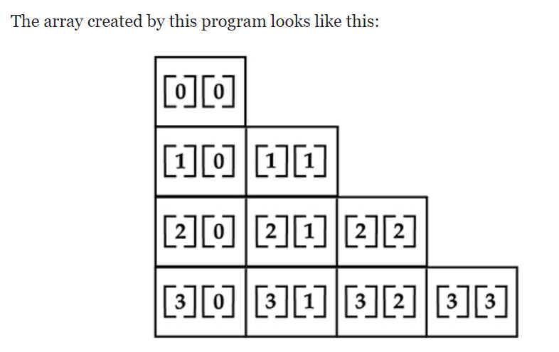

# Chapter 3 - Data types Variables and Arrays

- Java is a strongly typed language
- Ensures safety and robustness
- Every expression has a type and every type is strictly defined.
- No automatic coercions or conversions of conflicting types
- Any issues will produce a compiler error

## The Primitive Types

- Primitive Types: byte, short, int, long, char, float, double, boolean

  - Integers - byte, short, int, long
  - Floating Point - float, double
  - Characters - char
  - Boolean - boolean

- These plus any classes created make up all types.
- Primitives represent single values (primitive types are not OO)

### Integer Types

- All integer types are signed, java does not support unsigned ints

| Name  | Width | Range                                                   |
| ----- | ----- | ------------------------------------------------------- |
| long  | 64    | -9,223,372,036,854,775,808 to 9,223,372,036,854,775,807 |
| int   | 32    | -2,147,483,648 to 2,147,483,647                         |
| short | 16    | -32,768 to 32,767                                       |
| byte  | 8     | -128 to 127                                             |

- Width of an integer type should not be thought of as the amount of storage, but rather the behaviour that it exhibits

#### byte

- Smallest integer type
- Signed 8 bit integer type ranging from -128 to 127
- Useful for working with a stream of data from a network or file
- Also useful when working with raw binary data not compatible with any other built in types
- The following declares two byte variables `byte b, c;`

#### short

- short is a signed 16 bit integer type ranging from -32,768 to 32,767
- One of the least used data types in Java
- `short s;`

#### int

- int is the most commonly used number type
- Used to control loops and to index arrays
- Often byte and short get promoted to int anyways for calculation so using int is usually ok to do for most int uses

#### long

- long is a signed 64 bit type which can be used for numbers that go larger than int can hold
- The range of long is very big
- Useful for scientific calculations and other calculations using large numbers

### Floating-Point Types

- Floating point numbers (real numbers) are numbers with fractional parts
- Two types, float and double, single and double precision numbers respectively

| Name   | Width in Bits | Range               |
| ------ | ------------- | ------------------- |
| double | 64            | 4.9e-324 to 1.8e308 |
| float  | 32            | 1.4e-45 to 3.4e38   |

#### float

- Single precision value that uses 32 bits of storage
- Float is useful when you need a fractional component, bu t don't require a large degree of precision

#### double

- Double uses 64 bits to store a value
- Double is actually faster than single precision on modern processors
- All common math funtions that return fractional numbers return doubles

### Characters

- char can be used to store a single character
- Java uses unicode to represent chars
- in Java char is a 16 bit type, range 0 - 65,535
- ASCII ranges from 0 - 127
- Using unicode enables worldwide usage of Java

### Boolean

- Primitive for logical values
- Value of either true or false
- Returned by all relational operators (ie a < b)
- Required by conditional staements that govern the if and for statements

## A Closer Look at Literals

- Now lets look at the literals for built in types

### Integer Literals

- Integers are the most commonly used type

  - Any whole number is an integer literal ie: 1 2 3 and 42
  - Integer literals can be specified in base 10, octal, or hexadecimal, or binary
  - Octal literal - 0777
  - Hexadecimal literal - 0x1f

- Int literals can be used to set byte and short varables as long as the value is in the range
- int literals can always be converted to longs
- Appending an L means its a long literal ex 0x7ffffffffffL
- Underscores can be embedded into long numbers to make them more readable: ie. 1_000_000_000_000
  - Useful when using binary int literals
  - `int x = 0b1101_0101_0001_1010;`

### Floating point Literals

- Floating point literals default to double
- To specify a float literal then append an f to the end of the number ie `1.3f`

### Boolean Literals

- Simple, only two values
- true or false
- Not equal to 1 and 0 like in C

### Character Literals

- Characters are indexes into the Unicode character set
- 16 bit values that can be converted to integers and manipulated with integer operators such as add and subtract
- A literal is a single character between single quotes
- escape sequences can be used to enter characters without a key
- Octal -> '\141' -> 'a'
- Unicode -> '\ua432' -> Japanese character

| Escape Sequence | Description                       |
| --------------- | --------------------------------- |
| \ddd            | Octal character                   |
| \uxxxx          | Hexadecimal Unicode character     |
| \'              | Single Quote                      |
| \"              | Double Quote                      |
| \\              | Backslash                         |
| \r              | Carriage Return                   |
| \n              | New line (line feed)              |
| \f              | Form Feed                         |
| \t              | Tab                               |
| \b              | Backspace                         |
| \s              | Space (JDK15+)                    |
| \endofline      | Continue Line (textblocks JDK15+) |

### String Literals

- String literals are sequences of characters between double quotes
- Escape sequences for octal/hex work inside of string literals
- Java string literals must begin and end on the same line, even if the line wraps
- No line-continuation escape sequence (text block was added in JDK 15 to be able to handle this case)
- Strings are not arrays of characters, they are objects

## Variables

- Variable is the basic unit of storage in a Java program
- Variables have scope (which defines viaibiltiy) and a lifetime

### Declaring a variable

- Variables must be declared before they are used
- Examples

```java
int a,b,c;              // declares 3 ints
int d = 3, e, f = 5;    // declares 3 more ints initializing d and f
byte z = 22;            // initializes z
double pi = 3.14159;    // declares an approximation of pi
char x = 'x';           // the variable x has the value 'x'
```

### Dynamic Initialization

- Java allows variables to be initialized dynamically using any expression that is valid at the time that the variable is declared
- See [DynInit.java](code/DynInit.java) for example

### The Scope and Lifetime of Variables

- So far we have been declaring variables directly in the main method
- However we can declare variables in any block
- A block defines a scope, and the lifetime of the objects declared in it
- Common scopes
  - Class scope
  - Method scope
- A method's parameters are included within the scope
- Variables declared within a scope are not visible to code defined outside the scope
- Thus when we declare a variable within a scope we localize it and protect it from outside access
- Scope rules provide the foundation for encapsulation
- Scopes can be nested
- Objects declared in an outer scope are visible within nested inner scopes
- See Scope.java for an example

- Within a block varables can be declared anywhere but are only available after declaration
- In [Scope](code/Scope.java) y is commented out because it would throw an error since y is not known outside the scope where it is declared
- Variables are created when their scope is entered and destroyed when their scope is left.
- Though nesting is allowed, you cannot create a duplicate local variable with the same identifier See [ScopeErr](code/ScopeErr.java)

## Type Conversion and Casting

- When assigning one type to another if the two types are compatible Java will make an automatic type conversion
  - Its always possible to assign an int to a long variable
  - No automatic conversion from double to byte
- To force conversion between incompatible types we do a cast operation

### Java's Automatic Conversions

- When one type is assigned to a variable with another type an automatic type conversion will happen if the following 2 conditions are met
  1. The types are compatible
  2. The destination type is larger than the source type
- When these 2 conditions are met then a widening conversion happens
- No automatic conversion from char to boolean (char and boolean are not compatible)

### Casting Incompatible Types

- Automatic type conversions are nice but won't fit every situation
- For example converting an int to a byte
- Called a narrowing conversion because you are fitting the data into a narrower data type than the source
- To force a conversion between incompatible types you must do a cast
  `(target-type) value`

- Demo how to force convert an int to byte

```java
int a;
int b;
//
b = (byte) a;
```

- A different type of conversion happens when a floating point value is assigned to an integer type: truncation
- The fractional component is lost during trunction
- See [Conversion](code/Conversion.java)

### Automatic Type Promotion in Expressions

- Automatic type conversions can occur in expressions
- In an expression the precision required of an intermediate value may overflow the range of either operand

```java
byte a = 40;
byte b = 50;
byte c = 100;
int d = a * b / c;
```

- The result of a \* b exceeds the reange of either byte operand
- To handle this Java auto promotes byte, short and char to int when evaluating an expression
- This means that a \* b is actually done on integers, not bytes; 2000 is legal even though it overflows the byte range
- Can cause confusing issues

```java
byte b = 50;
b = b * 2; // Error cannot assign an int to a byte
```

- To fix this code we need to do it like this

```java
byte b = 50;
b = (byte)(b * 2);
```

### The Type Promotion Rules

- byte, short and char values are promoted to int
- If one operand is a long, then the whole expression is promoted to long
- If one operand is a float, the entire expression is promoted to float
- If any operands are a double, the result is a double
- See [Promote](code/Promote.java)

## Arrays

- An array is a group of like typed variables that are referred to by a common name
- A specific element of an array is accessed by its index
- Convenient way of grouping related information

### One Dimensional Arrays

- Essentially a list of like typed variables
- Declare an array variable of the desired type

```java
type[] varname;
```

- Where type defines the base type of the array
- Each element of the array must be this base type

```java
int[] month_days;
```

- No array exists until one is created using new and assigned to month_days
- new is a special operator that allocates memory

```java
month_days = new int[12];
```

- Now month_days refers to an array of 12 integers; all elements are initialized to 0
- Creating an array is a two step process
  - Declare a variable of the desired type array
  - Then allocate the memory that will hold the array using new and assign to the array variables
- Once an array is allocated then its elements can be accessed by their index
- Array indicies start at 0
- See [Array](code/Array.java)
- Can combine both declare and initialize like so

```java
int[] month_days = new int[12];
```

- Array initializer is a list of comma separated expressions surrounded by curly braces

```java
class AutoArray {
    public static void main(String[] args) {
        int[] month_days = {31, 28, 31, 30, 31, 30,31, 31, 30,31,30,31}
    }
}
```

- Java ensures that you don't try to store or reference beyond the boundary of the array
- Java run time system will check that array indexes are in the correct range
- Access outside the array bounds will cause a Runtime error

### Muti Dimensional Arrays

- Multidimensional Arrays are implemented as arrays of arrays
- The following declares a two-dimensional array varaiable called twoD

```java
int[][] twoD = new int[4][5];
```

- This allocates a 4 x 5 array and assigns it to twoD
- See [TwoDArray](code/TwoDArray.java)

- When you allocate memory for a multidimensional array, you only need to specify the size of the first dimension
- This allocates momory for the first dimension when it is declared, it alloacates the second dimension separately

```java
int[][] twoD = new int[4][];
twoD[0] = new int[5];
twoD[1] = new int[5];
twoD[2] = new int[5];
twoD[3] = new int[5];
```

- When you allocate dimensions individually you do not need to allocate the same number of elements for each dimension
- Since multidimensional arrays are arrays of arrays, you control the length of each array
- See [TwoDAgain](code/TwoDAgain.java) for an example program that creates an array where the sizes of the second dimension are unequal



- This is an odd situation since we expect the dimensions of multi dimensional arrays to be equal
- But if you need a large two dimensional array that is sparsely populated, then an irregular array may be considered.
- [Matrix](code/Matrix.java) Multi dimensional arrays can use initializer list syntax.
- [ThreeDMatrix](code/ThreeDMatrix.java) creates a 3 x 4 x 5 three dimensional array.

### Alternative Array Declaration Syntax

- A second form may be used to declare an array `type var-name[]`
- The square brackets follow the variable name rather than the type
- The following declarations are equivalent

```java
int a1[] = new int[3];
int[] a2 = new int[3];
```

- This offers convenience when converting code from C/C++ to Java

## Introducing Type Inference with Local Variables

Starting in JDK10 it is now possible to let the compiler infer the type of a local variable based on the type of its initializer; avoiding the need to explicitly specify the type

Advantages of LVTI

- Eliminates the need to redundantly specify the variable type when it can be inferred by the initializer
- Simplify declarations in cases when the type name is lengthy
- Helpful when a type is difficult to figure out

To support local variable type inference the context-sensitive keyword **var** was added.

So we can rewrite `double avg = 10.0;` as `var avg = 10.0;`. In both cases the variable avg will be of type double. In the example with var it is inferred as double since the value used to initialize the variable is a double literal.

**var** is context sensitive. When used as the type name in teh context of a local variable declaration it tells the compiler to use type inference to determine the type of the variable based on the initializer. Elsewhere var is just a user-defined identifier with no special meaning

```java
int var = 1 // This just creates a variable named var
```

See [VarDemo](code/VarDemo.java) for example

It gives an output like the following

```
Value of avg: 10.0
Value of var: 1
Value of k: -1
```

**var** can also be used to declare more complex variable such as arrays. For Example

```java
var myArray = new int[110]; // this is valid
```

You cannot declare a variable using var that uses the array syntax, it must be inferred.

Also var can only be used to declare local variables; it cannot be used when declaring instance variables, parameters or return types

### Some var Restrictions

- Only one variable can be declared at a time
- a variable cannot use null as an initializer
- the variable being declared cannot be used by the initializer expression
- you cannot use **var** with the array initializer syntax
- var cannot be used as the name of a class
- It cannot be used as the name of other reference types (interface, enum, annotation, or generic type parameter)

## A Few Words About Strings

Java supports a String data type, it is called `String`. String is not a primitive type, nor is it simply just an array of characters. String is an object and we will talk later about what that implies.

String type is used to declare string variables. You can also declare arrays of strings. String objects have many special features and attributes that make them quite powerfula nd easy to use.
